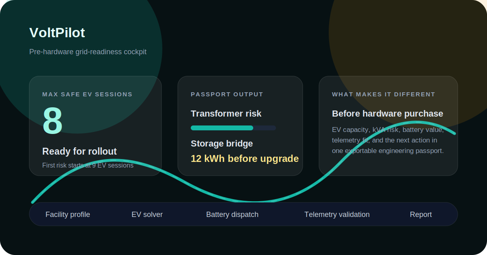
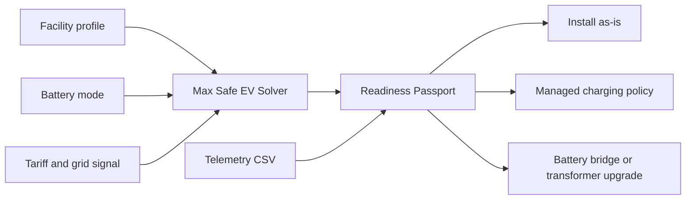

# VoltPilot

Pre-hardware grid-readiness cockpit for EV charging, flexible building loads, transformer loading, virtual grid signals, telemetry validation, and engineering report generation.



VoltPilot is a software-first electrical and electronics engineering portfolio project. It runs without physical hardware, models small-facility scenarios, simulates flexible-load orchestration, estimates transformer loading, solves the maximum safe EV concurrency before hardware purchase, and validates simulated dispatch against mock or measured telemetry samples.

## Why It Matters

EV charging, cooling demand, and small distributed resources make local grid flexibility more valuable. Many small facilities do not have a practical way to estimate transformer stress, flexible-load potential, or whether a control strategy will create measurable value.

VoltPilot demonstrates that workflow in software first. It works today without hardware, but its telemetry and public-data contracts can later be connected to ESP32, MQTT, smart-plug data, or live grid-data providers.

## Core Differentiator

Most energy tools focus on monitoring, general optimization, or operating installed EV chargers. VoltPilot focuses on the decision before hardware is purchased:

> How many EV charging sessions can this facility support safely, where does transformer risk begin, and should the next move be a charging policy, a battery bridge, or a transformer upgrade?

The answer is packaged as a **Readiness Passport**:

- Max Safe EV Solver: estimates the largest EV concurrency that stays inside transformer kVA and overload limits.
- First-risk threshold: shows the EV count where the facility leaves the safe pre-hardware envelope.
- Storage bridge estimate: approximates the battery energy needed to hold the requested plan inside the managed stress band.
- Transformer upgrade target: recommends the next standard kVA rating when the requested plan exceeds the envelope.
- Control-mode envelope: compares uncontrolled, tariff-aware, orchestrated, and optimizer strategies on the same facility.
- Exportable proof: JSON, CSV, Markdown report, and UI all use the same tested scenario model.



## Completed Features

- English dashboard and operator cockpit
- Facility profiles for apartment blocks, workshops, cafes, and electronics labs
- EV concurrency, tariff plan, control strategy, storage, analysis horizon, and scenario preset controls
- URL-shareable scenarios and browser-local saved scenarios
- 24-hour or 7-day load profile with uncontrolled baseline, mock/imported telemetry, and transformer limit
- kW, kVA, current, power factor, overload-hour, battery SoC, cost, carbon, and engineering-confidence KPIs
- Readiness Passport with max safe EV sessions, first-risk threshold, storage bridge estimate, and transformer upgrade target
- EV capacity envelope across uncontrolled, tariff-aware, orchestrated, and optimizer strategies
- Strategy comparison for uncontrolled, tariff-aware, orchestrated, and constraint-optimized operation
- Lightweight optimizer for peak shaving, tariff exposure, battery SoC, and transformer headroom
- `/api/grid-signal` virtual grid signal API
- EPİAŞ, ENTSO-E, Electricity Maps, and Ember adapter-ready provider model
- Source status panel with credential names, refresh notes, granularity, and documentation links
- `/api/scenario` JSON and CSV export
- `/api/telemetry` measured-vs-simulated comparison API
- Telemetry CSV import in the cockpit with template download
- `/api/report` downloadable Markdown engineering report
- Vitest coverage for the simulation engine, telemetry, CSV, grid signal, and API behavior
- GitHub Actions CI for test, typecheck, lint, and build

## Virtual Data Approach

The project starts with virtual data instead of physical measurement hardware:

- EPİAŞ Transparency Platform is modeled as the primary official adapter target for Turkish market, generation, consumption, and transmission data.
- ENTSO-E Transparency Platform is kept as an alternative adapter target for European power-system data.
- Electricity Maps is modeled as an optional adapter for carbon intensity, electricity mix, load, and price signals.
- Ember is modeled as an optional adapter for monthly and yearly demand, generation, emissions, and carbon-intensity datasets.
- If no API keys are configured, the app generates deterministic 24-hour demo data for Turkey. The demo stays reliable and the tests do not depend on the internet.

Sources: [EPİAŞ technical documentation](https://seffaflik-prp.epias.com.tr/electricity-service/technical/tr/index.html), [ENTSO-E Transparency Platform](https://transparency.entsoe.eu/), [Electricity Maps API](https://portal.electricitymaps.com/docs/api), [Ember API](https://ember-energy.org/data/api/).

## Data Refresh Notes

VoltPilot does not currently poll live external APIs. The default grid signal is deterministic virtual data generated for the requested date, so every run is reproducible and CI-safe.

When live adapters are implemented, refresh behavior should be provider- and dataset-specific:

- EPİAŞ: Official Turkish market and transparency datasets are published through EPİAŞ services; refresh cadence depends on the selected dataset and market process.
- ENTSO-E: Transparency Platform data is exposed through multiple channels, including REST API and file/subscription workflows; publication timing and resolution depend on the data item.
- Electricity Maps: API endpoints default to hourly temporal granularity and can support 5-minute, 15-minute, hourly, and aggregated historical granularities where available.
- Ember: Monthly Electricity Data is updated twice per month, with releases in the first and third weeks of the month.

## Tech Stack

- Next.js App Router
- TypeScript
- Tailwind CSS
- Recharts
- Vitest
- Scenario simulation engine
- Virtual grid signal API
- Stateless telemetry comparison API
- CSV and JSON exports

## Quick Start

```bash
pnpm install
pnpm dev
```

Open `http://localhost:3000`.

## Quality Commands

```bash
pnpm test
pnpm typecheck
pnpm lint
pnpm build
pnpm check
```

## API Examples

Scenario JSON:

```text
/api/scenario?siteType=workshop&strategy=orchestrated&batteryMode=small&tariffPlan=tou&evCount=4
```

Readiness Passport stress case:

```text
/api/scenario?siteType=apartment&strategy=baseline&batteryMode=none&tariffPlan=critical&evCount=24&analysisDays=7
```

7-day optimizer scenario:

```text
/api/scenario?siteType=workshop&strategy=optimizer&batteryMode=medium&tariffPlan=critical&evCount=8&analysisDays=7
```

Scenario JSON with grid signal:

```text
/api/scenario?siteType=workshop&strategy=orchestrated&batteryMode=small&tariffPlan=tou&evCount=4&gridProvider=epias&gridDate=2026-05-06
```

Scenario CSV:

```text
/api/scenario?siteType=workshop&strategy=orchestrated&batteryMode=small&tariffPlan=tou&evCount=4&format=csv
```

Virtual grid signal:

```text
/api/grid-signal?provider=demo&date=2026-05-06
```

Telemetry comparison:

```bash
curl -X POST http://localhost:3000/api/telemetry \
  -H "Content-Type: application/json" \
  -d '{
    "mode": "mock",
    "scenario": {
      "siteType": "workshop",
      "strategy": "orchestrated",
      "batteryMode": "small",
      "tariffPlan": "tou",
      "evCount": 4
    }
  }'
```

Engineering report:

```text
/api/report?siteType=workshop&strategy=optimizer&batteryMode=medium&tariffPlan=critical&evCount=8&analysisDays=7&gridProvider=epias&gridDate=2026-05-06
```

## Environment Variables

The app works without these values. If credentials are added later, live adapters can be implemented while keeping the same API contract.

```env
EPIAS_TGT=
ENTSOE_TOKEN=
ELECTRICITY_MAPS_TOKEN=
EMBER_API_KEY=
```

## Repository Structure

- `app/api/scenario/route.ts` - scenario JSON and CSV export
- `app/api/grid-signal/route.ts` - virtual grid signal endpoint
- `app/api/telemetry/route.ts` - telemetry validation and comparison
- `app/api/report/route.ts` - Markdown engineering report export
- `components/energy` - cockpit UI and dashboard panels
- `src/lib/energy/flexgrid.ts` - simulation engine
- `src/lib/energy/grid-signal.ts` - virtual grid signal core
- `src/lib/energy/telemetry.ts` - measured-vs-simulated comparison core
- `src/lib/energy/report.ts` - report generation core
- `tests` - model, telemetry, CSV, grid signal, and API tests
- `docs` - architecture, telemetry, validation, API, virtual-data, and roadmap notes

## Suggested GitHub Description

Pre-hardware grid-readiness cockpit for EV charging, transformer risk, battery dispatch, virtual grid signals, and telemetry validation.

## Suggested Topics

`nextjs`, `typescript`, `energy`, `smart-grid`, `demand-response`, `ev-charging`, `power-systems`, `telemetry`, `recharts`, `turkey`

## License

MIT. Copyright (c) 2026 Emre Bulut.
