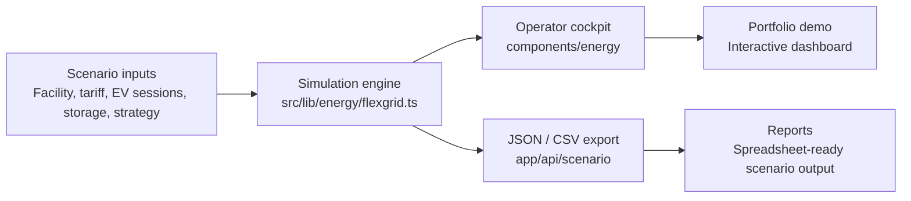

# FlexGrid-TR Architecture

FlexGrid-TR is intentionally small, but its boundaries are shaped like a real product. Scenario inputs are handled once, the simulation core produces a structured result, and both the UI and export route consume that same result.

## Layers

### Application entry

- `app/page.tsx`
- `app/layout.tsx`

The app starts directly with the cockpit instead of a marketing-first landing page.

### Cockpit UI

- `components/energy/flexgrid-page.tsx`
- `components/energy/flexgrid-simulator.tsx`

This layer renders controls, KPI tiles, charts, recommendations, and roadmap sections.

### Simulation engine

- `src/lib/energy/flexgrid.ts`

The engine owns:

- site profiles
- tariff plans
- strategy options
- storage assumptions
- hourly load profile generation
- cost, carbon, and stress metrics
- strategy comparison
- recommendations

### Export layer

- `app/api/scenario/route.ts`

The API returns full JSON by default and spreadsheet-ready CSV when `format=csv` is passed.

## Design decision

The first complete release stays simulation-first. This keeps the project easy to run from GitHub while still leaving a clear path to physical telemetry. A single measured channel can be added later without rewriting the cockpit or the scenario output model.

## Extension points

- Add telemetry ingestion route
- Persist scenario runs
- Compare measured and simulated profiles
- Add EV departure-time prioritization
- Add ENVER-style reporting output
