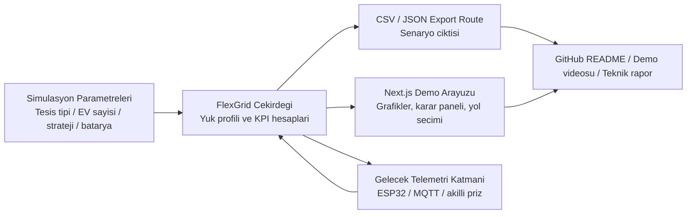

# FlexGrid-TR Mimari Notlari

FlexGrid-TR, bina yuklerini, EV sarjini ve talep tarafi katilimi mantigini ayni urun cekirdeginde gosteren acik kaynak bir MVP olarak kurgulandi.

## Sistem amaci

- Donanimsiz baslayabilmek
- Gercek saha mantigina benzeyen bir simulasyon sunmak
- Sonradan ESP32 veya benzeri dusuk maliyetli donanim ile genisleyebilmek
- GitHub uzerinde hem teknik hem urunsel olarak guclu gorunmek

## Mantiksal mimari

## Kod katmanlari

### 1. Sunum katmani

- `app/page.tsx`
- `components/energy/flexgrid-page.tsx`
- `components/energy/flexgrid-simulator.tsx`

Bu katman kullanicinin gordugu deneyimi ve etkileşimi tasir.

### 2. Icerik katmani

- `src/content/flexgrid-copy.ts`

Bu katman urun dili, yol haritasi, sektor gerekcesi ve proje anlatimini merkezi hale getirir.

### 3. Muhendislik cekirdegi

- `src/lib/energy/flexgrid.ts`

Bu katman tesis profillerini, strateji seceneklerini ve senaryo hesaplarini tutar. UI ve API ayni hesap modelini kullanir.

### 4. Disa aktarim katmani

- `app/api/scenario/route.ts`

Bu route ayni senaryoyu JSON veya CSV olarak disa aktarir. Boylece UI ile indirme ciktisi arasinda fark olusmaz.

## Bugunku veri akisi

1. Kullanici simulator parametrelerini secer.
2. `flexgrid.ts` secilen kombinasyon icin 24 saatlik yuk ve KPI hesaplar.
3. Grafikler ve karar kartlari ayni sonucu gosterir.
4. Kullanici isterse ayni sonucu CSV olarak indirir.

## Gelecek genisleme noktasi

### Hibrit telemetri

- ESP32 olcum dugumu
- MQTT veya HTTP ingestion
- Dakikalik veya 5 dakikalik zaman serisi
- Simule veri ile gercek veri karsilastirmasi

### Karar motoru

- Basit kural tabanli yuk kaydirma
- TOU optimizasyonu
- Batarya sarj / desarj tavsiyesi
- Demand response event handling

### Raporlama

- ENVER benzeri ozet ciktilar
- Aylik pik analizi
- Esnek yuk potansiyeli skoru
- Cihaz bazli katkı dagilimi

## GitHub icin ideal cikti paketi

- Calisan demo rota
- Ekran kaydi veya kisa demo videosu
- Mimari diyagram
- README icinde problem, cozum, stack, yol haritasi
- Bir sonraki faz olarak hibrit telemetri planı

