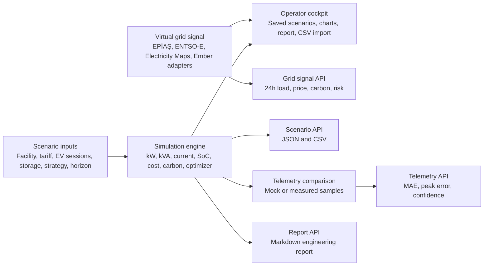

# FlexGrid-TR Architecture

FlexGrid-TR is a hybrid-ready software demonstrator. The current release does not require physical hardware, but the data boundaries are shaped so public grid signals and real telemetry channels can replace the deterministic demo data later.

## Runtime layers

- The UI owns interaction state: selected scenario, saved local scenarios, shareable URL parameters, and mock telemetry display.
- The simulation engine owns engineering truth: load profile generation, battery behavior, transformer loading, cost, carbon, and confidence scoring.
- The grid-signal module owns public-data readiness: deterministic demo data today, provider-compatible contracts for EPİAŞ, ENTSO-E, Electricity Maps, and Ember later.
- The telemetry module owns measured-vs-simulated comparison, mock sample generation, and CSV telemetry parsing.
- The report module owns Markdown engineering report generation and is reused by the UI and `/api/report`.
- The API layer is stateless and deterministic, which keeps the project easy to run from GitHub.

## Engineering model

The model estimates:

- active power in `kW`
- apparent power in `kVA`
- transformer loading percentage
- three-phase current at nominal 400 V service
- site-level power factor
- battery charge/discharge and state of charge
- lightweight peak-shaving and tariff-aware optimizer behavior
- peak-event reduction
- daily energy, monthly cost, and carbon impact
- 24-hour and 7-day analysis horizons
- engineering confidence score

The model is not a power-flow solver. It is intentionally a transparent portfolio-grade simulator that makes assumptions explicit and testable.

## Telemetry boundary

`POST /api/telemetry` accepts scenario parameters plus measured samples. In `mock` mode, it generates deterministic samples from the selected scenario. In measured mode, the endpoint validates the payload and compares the measured profile with the simulated dispatch.

The cockpit also accepts telemetry CSV files with `hourIndex` and `measuredKw` columns. Optional `voltageV`, `currentA`, and `powerFactor` columns improve electrical comparison but are not required.

This is the planned replacement point for:

- ESP32 HTTP posts
- MQTT bridge output
- smart-plug export files
- manually collected measurement data

## Virtual grid boundary

`GET /api/grid-signal` accepts `provider` and `date` query parameters. Without credentials, it returns deterministic 24-hour demo data for load, market price, renewable share, carbon intensity, and demand risk. External providers currently use the same schema with fallback data so the application stays reliable during portfolio review.

Supported provider IDs:

- `demo`
- `epias`
- `entsoe`
- `electricity-maps`
- `ember`

## Storage decision

Scenario persistence uses browser localStorage under `flexgrid-tr:v1:scenarios`. This avoids database setup while still giving the demo a product-like workflow. The backend stays stateless.
