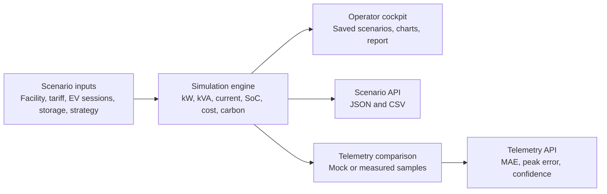

# FlexGrid-TR Architecture

FlexGrid-TR is a hybrid-ready software demonstrator. The current release does not require physical hardware, but the data boundaries are shaped so a real telemetry channel can replace the mock samples later.

## Runtime layers

- The UI owns interaction state: selected scenario, saved local scenarios, shareable URL parameters, and mock telemetry display.
- The simulation engine owns engineering truth: load profile generation, battery behavior, transformer loading, cost, carbon, and confidence scoring.
- The telemetry module owns measured-vs-simulated comparison and can be reused by the UI and API.
- The API layer is stateless and deterministic, which keeps the project easy to run from GitHub.

## Engineering model

The model estimates:

- active power in `kW`
- apparent power in `kVA`
- transformer loading percentage
- three-phase current at nominal 400 V service
- site-level power factor
- battery charge/discharge and state of charge
- peak-event reduction
- daily energy, monthly cost, and carbon impact
- engineering confidence score

The model is not a power-flow solver. It is intentionally a transparent portfolio-grade simulator that makes assumptions explicit and testable.

## Telemetry boundary

`POST /api/telemetry` accepts scenario parameters plus measured samples. In `mock` mode, it generates deterministic samples from the selected scenario. In measured mode, the endpoint validates the payload and compares the measured profile with the simulated dispatch.

This is the planned replacement point for:

- ESP32 HTTP posts
- MQTT bridge output
- smart-plug export files
- manually collected measurement data

## Storage decision

Scenario persistence uses browser localStorage under `flexgrid-tr:v1:scenarios`. This avoids database setup while still giving the demo a product-like workflow. The backend stays stateless.
